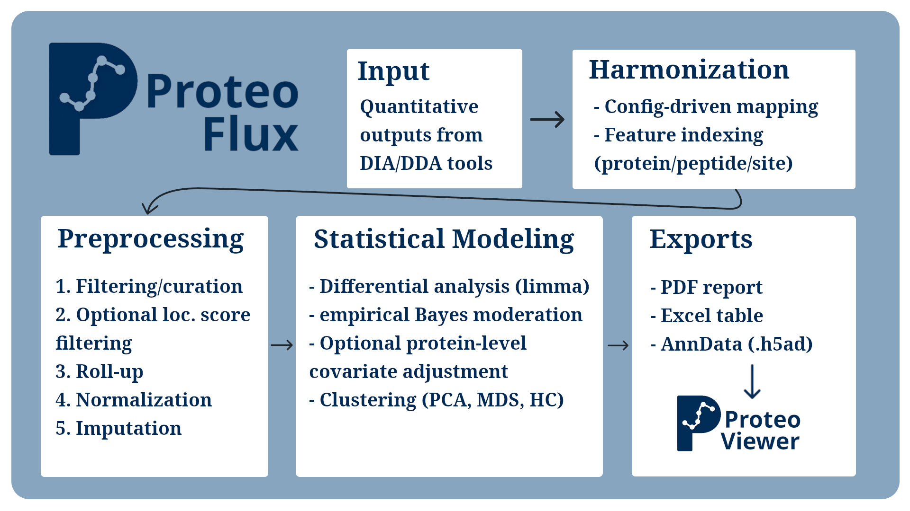

# ProteoFlux
[](https://doi.org/10.5281/zenodo.18640998)

ProteoFlux is an open-source Python framework for transparent, reproducible downstream analysis of quantitative proteomics data.

It operates on quantitative outputs generated by upstream search and quantification tools and provides a unified workflow for:

- Protein-centric proteomics  
- Peptide-centric analyses  
- Phosphoproteomics (with optional protein-level covariate adjustment)

ProteoFlux emphasizes:

- Explicit data semantics  
- Transparent preprocessing  
- Deterministic statistical modeling  
- Fully reproducible outputs  

---

## Overview



ProteoFlux takes a single YAML configuration file and produces:

- Harmonized and preprocessed quantification data
- Differential expression results using a limma-based empirical Bayes framework
- Principal component analysis (PCA), multidimensional scaling (MDS), and hierarchical clustering
- A structured multi-page PDF report
- Portable `.h5ad` files compatible with [ProteoViewer](https://github.com/Afanc/proteoviewer)
- Summary tables in Excel

---

## Installation

Python ≥ 3.9 required.

### Install from source (recommended)

```bash
git clone https://github.com/YOUR-ORG/proteoflux.git
cd proteoflux
pip install -e .
```

This installs ProteoFlux in editable mode.

---

## Quickstart (CLI)

List available configuration templates:

```bash
proteoflux templates
```

Create a template:

```bash
proteoflux init spectronaut-proteomics --path config.yaml
```

Edit the file and then run the full pipeline:

```bash
proteoflux run --config config.yaml
```

---

## Output Files

| File | Description |
|------|------------|
| `*.h5ad` | Full AnnData object with raw, normalized, imputed data, statistics, embeddings, and metadata |
| `*.xlsx` | Differential expression summary table |
| `*.pdf` | Multi-page QC and analysis report |

The `.h5ad` files are compatible with [ProteoViewer](https://github.com/Afanc/proteoviewer), an interactive visualization tool for ProteoFlux outputs.

---

## Using ProteoFlux as a Python Library

ProteoFlux can also be used programmatically:

```python
import yaml
from proteoflux.main import run_pipeline

config = yaml.safe_load(open("config.yaml")) #or use a dict
run_pipeline(config)
```

This allows:

- Integration into larger workflows
- Batch processing
- Use inside Jupyter notebooks
- Custom downstream analysis of AnnData objects

All behavior is controlled by the same YAML schema used by the CLI.

---

## Configuration

All parameters are defined in a single YAML configuration file. We recommend starting with a template:

```bash
proteoflux templates
proteoflux init TEMPLATE_NAME
```

Full parameter reference:

See the configuration guide [docs/CONFIGURATION.md](docs/CONFIGURATION.md).

---

## Examples

Runnable, reduced example datasets and matching configs are provided under `examples/`:

- `examples/searle_small/`: small DIA proteomics example (Spectronaut export subset)
- `examples/phospho_small/`: phosphoproteomics example with an injected flow-through covariate run (Spectronaut export subsets)

Each example folder contains a `README.md` with a minimal command to run the pipeline (typically `proteoflux run --config <config>.yaml`) and the required input files (data + annotation, if applicable).

---

## Paper

The JOSS manuscript source is provided as [paper.md](paper.md).

---

## License

ProteoViewer is released under the MIT License. See the LICENSE file for details.

---

## Citation

If you use ProteoFlux in your work, please cite:

ProteoFlux (latest version).  
Zenodo. https://doi.org/10.5281/zenodo.18640998

A peer-reviewed publication is currently under submission.
